# Project I Team III

## Meet Sovmamadpubo - A trading algorithm
Sovmamadpubo is a trading algorithm that makes recommendations on when to buy or sell Bitcoin.
#### It uses several metrics to make recommendations:
* Stochastic Oscillator
* Volume-Weighted Average Price (VWAP)
* MAC D
* Puell Multiple
* Bollinger Bands
* Relative Strength Index

## Motivation

#### Take the first steps towards building a trading bot

### Questions

* What indicators can we use to help make profitable trades?
* How can we calculate ideal buy and sell points to enter and exit the market?
* Are using these trading indicators profitable?
* Can we combine multiple indicators into one indicator for a higher degree of confidence in the recommendations?

## Data Exploration: Coin Metrics API v4

#### API #1 - HTTP
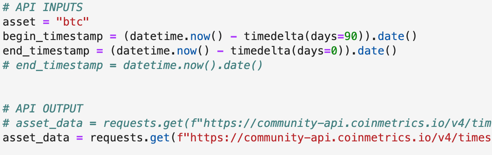

#### API #2 - pip install
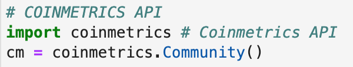
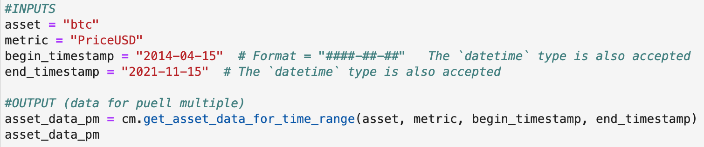

#### Raw Data
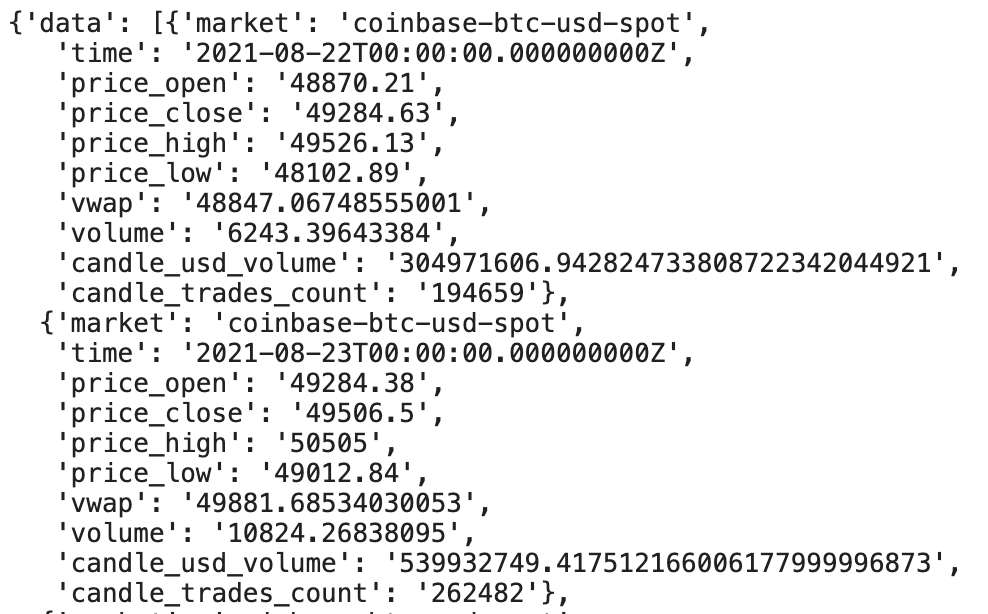

## Data Cleaning
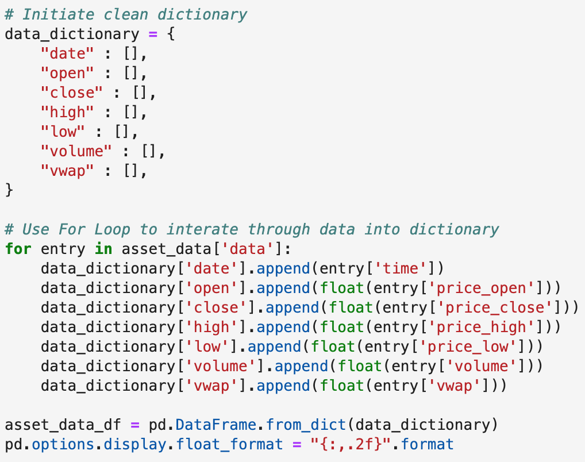

* Create a dictionary of empty lists (columns)
* Use for loop locate data, and append it into the dictionary
* Use pandas to convert a dictionary to a data frame
* Format DataFrame for readability

## Stochastic Oscillator

#### What is a Stochastic Oscillator?
SO is a momentum indicator that calculates whether an asset is overbought or oversold. SO is graphed on a scale from 0-100. Traditionally over 80 is considered overbought and under 20 is considered oversold. 

These signals will give us a better idea of when to buy or sell an asset. 

#### Stochastic Oscillator Formula
The calculation below finds the range between the high and low prices for a given period of time.
Calculation for 14 period SO indicator:

`%K = [(C - L14) / H14 - L14)] x 100`

Where: 
* C = Latest closing price
* L14 = Lowest price traded for previous 14 sessions
* H14 = Highest price traded for previous 14 sessions
* %K = Current value of the SO indicator

#### Stochastic Oscillator Graph
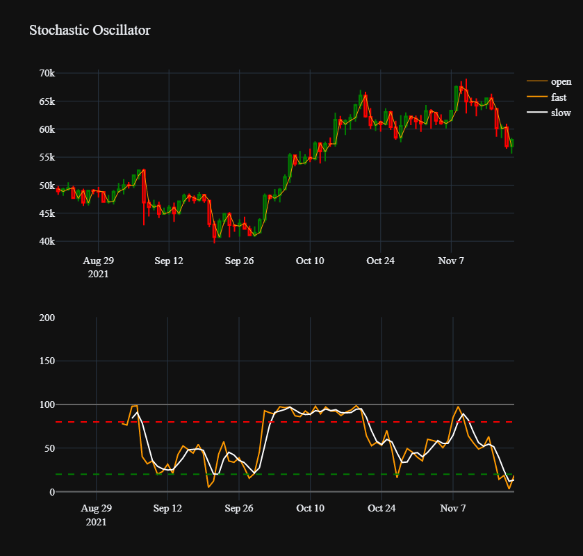

## Volume-Weighted Average Price (VWAP)
#### What is VWAP?
VWAP is the average value of an asset traded over a set time period, based on both volume and price.
This indicator is a helpful tool to see how the asset is trading throughout the day.

VWAP is more commonly used for day-trading. 

#### VWAP Formula
VWAP is calculated by price multiplied by the number of shares traded then divided by total shares. 

`VWAP = (P x V) / V`

Where:
* P = Price of share
* V = Volume
* VWAP = Volume Weighted Average Price

#### VWAP Graph (Moving Average - 20)
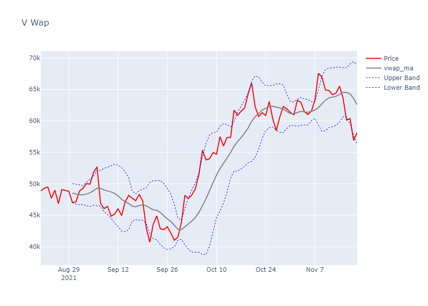

## Puell Multiple - Introduction
The Puell Multiple is a historically effective indicator for identifying the major market tops and bottoms of Bitcoin’s market cycles (approx 4 years). 

It focuses on the price of Bitcoin’s daily supply relative to its one-year rolling average supply.

`Puell Multiple = Daily Issued Coin Value in USD / Daily Issued Coin Value in USD (365 days moving average)`

#### Chart

* When the multiple is below .5 it is an ideal time to buy.

* When it moves above 4 it is an ideal time to sell.
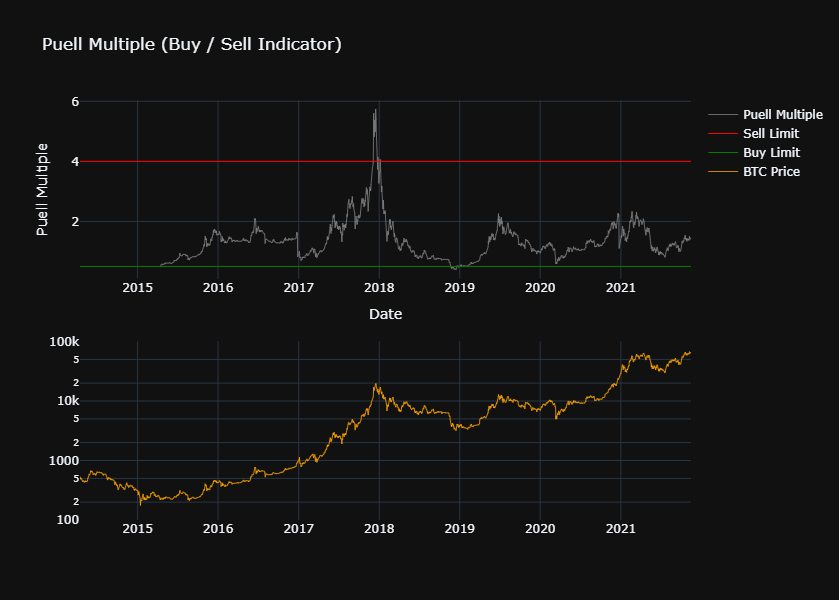

#### Entry & Exit Points
Theoretically, if you bought the “buy signal” in 2014 at `$200`, and then sold at the next “sell signal” in 2018 at `$10,000`, your trade would have been in profit by 5000%.

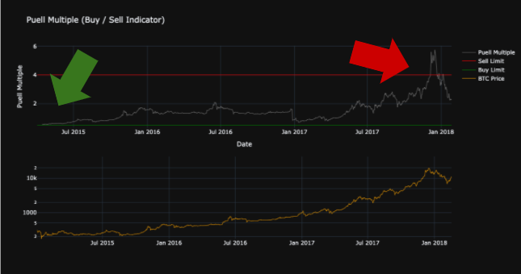
NOTE: This indicator was created in March 2019, so it has never actually predicted a market top.

## Bollinger Bands

#### Why?
* A technical indicator that analyzes the volatility of an asset, indicating if the price is too high/low.

#### What?
* Plot the price of the asset.
* Calculate the simple moving average (SMA).
* Find the upper and lower bands which are ± two standard deviations away from the (SMA).

#### How?
* Every time the price breaks out of the bands it will indicate either a buy or a sell signal.
* The wider/narrower the bands the more/less volatile the price is fluctuating. 

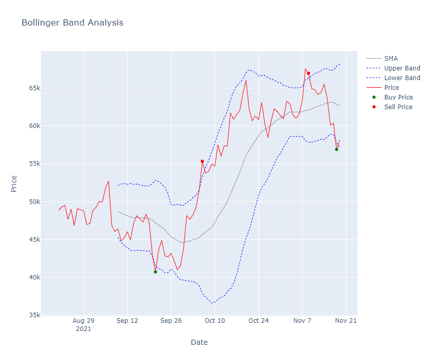

## Relative Strength Index (RSI)

#### Why?
* A momentum oscillator which will indicate if the market is overbought or oversold

#### What?
* The RSI line is the exponential moving averages (EMA) of the returns, gains, and losses of each day.
* Find the Relative Strength (RS) by dividing the  EMA Gain / EMA Loss.
* RSI = 100 – 100 / (1 + RS)
* Bound between 0 to 100 with bands between 30 and 70

#### How?
* Every time the RSI line crosses above/below the upper/lower band signals that the market is overbought/oversold.

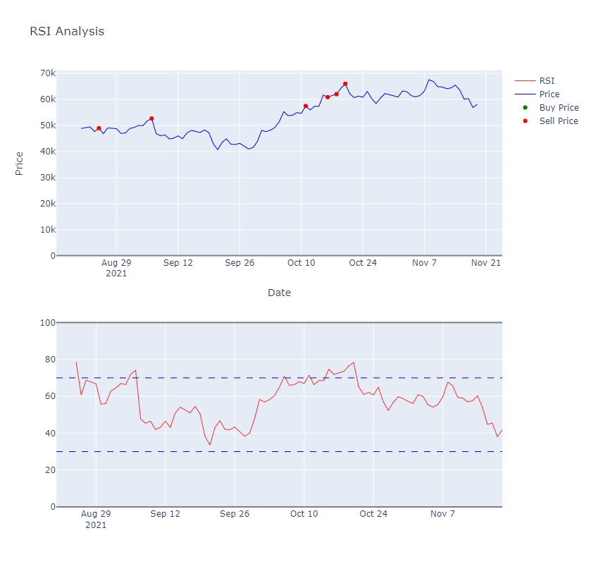

## MAC D - What is it?
The moving average convergence divergence is also known as MACD is an oscillator that measures the relationship between two exponential averages, one fast one slow. 

## Combined Buy/Sell Indicator 

#### Why?
* Combining all the oscillators to create one buy or sell signal on a rating scale.

#### What?
* Each oscillator was able to create its own trading strategy.
    * To Buy signal denoted by 1
    * To Sell signal denoted by -1
    * Neutral denoted by 0
Combining these individual trading strategies to get one rating scale (-5 to 5).

#### How?
* Rating Scale
    * (-5 to -3)  Strong Sell
    * (-2)  Moderate Sell
    * (-1)  Watch
    * (0) Neutral
    * (1) Watch
    * (2 to 3) Moderate Buy
    * (4 to 5) MOMMY MOMMY MOMMY
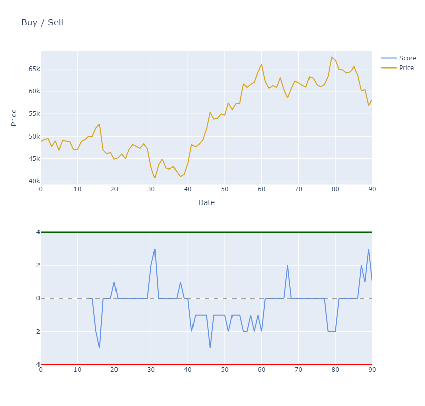    

## Postmortem
#### Challenges
* Free access to a variety of API metrics 
* Free access to API data for long time horizons
* Formatting dates for calculations, merging DataFrames, etc.
* Formatting chart (plotting breakouts, dual charts, logarithm scale, etc.) 

#### Next Steps (with more time)
* Backtesting algorithms with “paper trading” account
* Compare and quantify results of different indicators
* Use python library to send buy/sell notifications (SMTP lib library)

## Conclusion
#### What indicators can we use to help make profitable trades?
We found that the most common indicators used in trading equities also worked well in
generating sell and buy signals for crypto. Our data reflects that they follow
similar trends. 
* Stochastic Oscillator
* Volume-Weighted Average Price (VWAP)
* MAC D
* Puell Multiple
* Bollinger Bands
* Relative Strength Index

#### How can we calculate ideal buy and sell points to enter and exit the market?
Find the indicators that give the correct signal that corresponds with the price movement
of the cryptocurrency. We didn’t want an indicator that would give a signal to
early to lose out on value, but more importantly, we didn’t want an indicator
that acted too late. We would plot our graphs using an end-of-day closing strategy
to generate a more long-term approach when it came to trading. Yes, we can find entrances and exits in the market, but more testing could be done in the future to increase their accuracy. 

 
#### Are using these trading indicators actually profitable?
In the period of time, we were able to analyze our graphs and found they were
profitable and would have generated a profit of around 35%. Most of the indicators
are lagging indicators so it may not be a question if they are right but if they are on time.  The Puell Multiple looks at a much longer time horizon.  If you had bought during the 2014 buy signal at `$200`, and sold during the next sell signal in 2018 at `$10,000`, you would have `50x` your investment. 

#### Can we combine multiple indicators into one indicator for a higher degree of confidence in the recommendations?
Yes, we used a linear model when combining our five indicators giving each one an equal weight. We found when combining these indicators we received more cautious buy and sell signals, though cautious the price chart would hit a selling point, have a retrace then have a major breakout in the direction predicted.
